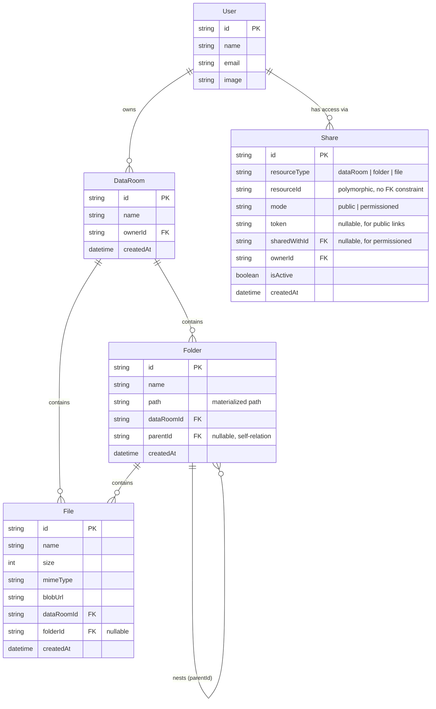

# Data Room

A minimal virtual Data Room application — create Data Rooms, organize nested folders and files inside them, and (optionally) share them with others.

Built with Next.js App Router, tRPC, Prisma, PostgreSQL, NextAuth (Google OAuth), shadcn/ui, and Vercel Blob for file storage.

# Live Demo

dataroom-dun.vercel.app

# Technologies

- [Next.js](https://nextjs.org)
- [NextAuth.js](https://next-auth.js.org)
- [OAuth](https://console.cloud.google.com)
- [Prisma](https://prisma.io)
- [Shadcn](https://ui.shadcn.com)
- [Tailwind CSS](https://tailwindcss.com)
- [tRPC](https://trpc.io)
- [Lucide](https://lucide.dev)

## Setup

### Prerequisites
- Node.js 20+
- pnpm
- Docker (for local PostgreSQL)

### Steps

1. Clone the repo and install dependencies:
   ```bash
   pnpm install
   ```

2. Copy `.env.example` to `.env` and fill in the values:
   ```bash
   cp .env.example .env
   ```
   You'll need:
   - `DATABASE_URL` — connection string for your local/hosted Postgres
   - `AUTH_SECRET` — generate with `npx auth secret`
   - `GOOGLE_CLIENT_ID` / `GOOGLE_CLIENT_SECRET` — from [Google Cloud Console](https://console.cloud.google.com/), OAuth 2.0 Client, with `http://localhost:3000/api/auth/callback/google` as an authorized redirect URI
   - `BLOB_READ_WRITE_TOKEN` — from a Vercel Blob store (Vercel Dashboard → Storage → Create → Blob)

3. Start the local database:
   ```bash
   ./start-database.sh
   ```

4. Run migrations:
   ```bash
   pnpm prisma migrate dev
   ```

5. Start the dev server:
   ```bash
   pnpm dev
   ```

App runs at `http://localhost:3000`.

## Design Decisions

**Architecture.** The codebase follows an entity/repository pattern: each domain concept (`DataRoom`, `Folder`, `File`, `Share`) has its own `entities/<name>/domain.ts` (the app-level type) and `entities/<name>/repositories/<name>-repository.ts` (all Prisma access for that entity). tRPC routers in `server/api/routers/` stay thin — they validate input with Zod, check the session, and delegate to the repository. This keeps data-access logic in one place per entity and makes routers easy to read.

**Folder hierarchy — materialized path.** Each `Folder` stores a `path` string (e.g. `/id1/id2/`) built from its parent's path plus its own id, in addition to a direct `parentId` foreign key. `parentId` is used for the common case — listing the direct children of a folder. `path` exists specifically to answer whole-subtree questions (see "How it scales" below) without recursive queries. This is a deliberate trade-off over a closure table: simpler to implement and query for this scope, at the cost of a slightly more expensive update if a folder were ever moved (not a current requirement, since move is only implemented for files).

**Sharing model.** `Share` is a single table with `resourceType` (`"dataRoom" | "folder" | "file"`) and `resourceId`, rather than three separate nullable foreign keys (`dataRoomId`, `folderId`, `fileId`) on the Share record. This means adding a new shareable resource type in the future is a code change, not a schema migration — see "How it scales." The trade-off is that Prisma can't enforce a real foreign-key constraint on `resourceId` (it isn't tied to one specific table), so referential integrity for that field is enforced in the repository layer instead of the database.

**Note on Sharing:** the `Share` model and its design rationale below were designed as part of the data model, but the sharing UI/API endpoints were not implemented due to time constraints. The model is ready to be built on top of — see "How it scales" for how it would extend to per-user roles.

**File location is optional, not folder-relative.** `File.folderId` is nullable — a file can live directly at the Data Room root (matching the Google Drive/Dropbox model referenced in the brief) rather than being forced into a folder.

**Root Data Room UX.** Users can create multiple Data Rooms rather than getting one auto-provisioned — this matches "share a Data Room" being a first-class action in the requirements, implying more than one can exist per user.

## Data Model / ERD



## How It Scales

**Computing total size and item count of a folder's subtree.**
Every folder stores a materialized `path` (e.g. `/A/B/`). To get all descendants of a folder at any depth, a single query filters `WHERE path STARTS WITH '<folder's path>'` — no recursive CTEs or N+1 traversal needed. From that result set, summing `File.size` and counting rows gives the subtree totals in one or two queries total (one for folders, one for files whose `folderId` is in the resulting folder id list). This is the same mechanism used for cascade-delete: find the whole subtree by path prefix, then delete it.

**Scaling to 100,000 files in one Data Room.**
- **Listing:** current `folder.list` / `file.list` queries filter by `dataRoomId` + `parentId`/`folderId`, which already limits result sets to one directory level rather than the whole Data Room — this is the main scaling lever, since no view ever needs to load all 100k rows at once.
- **Pagination:** not yet implemented — this is a known limitation. Straightforward next step is cursor-based pagination (`orderBy: createdAt` + `cursor`/`take`) on both `folder.list` and `file.list`, since offset pagination degrades on large tables.
- **Indexes:** `dataRoomId`, `parentId` (Folder), and `folderId` (File) should all be indexed (Prisma implicitly indexes foreign keys, but composite indexes on `(dataRoomId, parentId)` and `(dataRoomId, folderId)` would better match the actual query pattern). `path` should also be indexed to keep the `startsWith` subtree queries fast — Postgres can use a B-tree index for prefix matches like this.

**Extending sharing to per-user roles (viewer/editor) without remodeling.**
The current `Share` model already has a `mode` field distinguishing `public` and `permissioned` access, and a `sharedWithId` for the permissioned case. Adding roles doesn't require a schema change beyond adding a `role` field (e.g. `"viewer" | "editor"`) to `Share` — the polymorphic `resourceType`/`resourceId` design means this new field automatically applies uniformly across DataRoom, Folder, and File shares without introducing new join tables or relation types. Authorization checks in repositories/routers would then branch on `role` instead of just presence/absence of a Share record.

## Where AI Was Used

AI (Claude) was used throughout as a pair-programming and debugging partner, roughly in these ways:

- **Boilerplate by example:** once one entity (DataRoom) had a working repository/router pattern, AI helped scaffold the same shape for Folder, File, and Share — reducing repetitive typing, with each new piece checked against the existing pattern rather than accepted blind.
- **Debugging:** diagnosing and fixing concrete runtime errors — NextAuth misconfiguration (missing secret, OAuth redirect URI mismatch), a Prisma error caused by mixing `connect`-style and raw-scalar-style relation writes in the same `create` call, a React "Rules of Hooks" violation from a hook called after a conditional early return, and a redirect loop caused by placing an auth check in the wrong layout file.
- **Syntax lookup for an unfamiliar API surface:** Prisma-specific query patterns (e.g. `path: { startsWith: ... }` for subtree queries, `findMany` + explicit re-sorting for `id: { in: [...] }` queries) and the Vercel Blob client-upload API.
- **Architecture decisions were made by reasoning through trade-offs in conversation** (not accepted as AI suggestions outright) — for example, choosing `resourceType`/`resourceId` over three nullable foreign keys on `Share`, and confirming `parentId` (not `path`) is the right filter for listing a folder's direct children.

What was not delegated to AI: the decision of what entities the domain needed (derived directly from the functional requirements in this brief), UX flow decisions (multiple Data Rooms per user, root-level files), and manual verification of each piece of functionality in the browser before moving on.